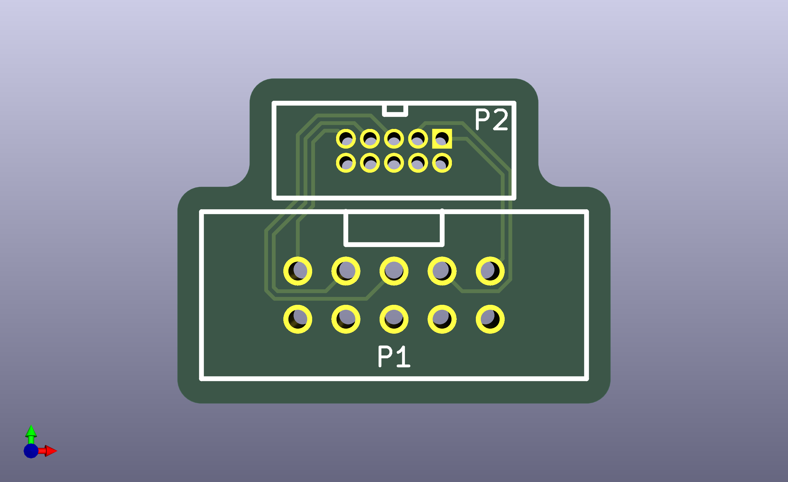
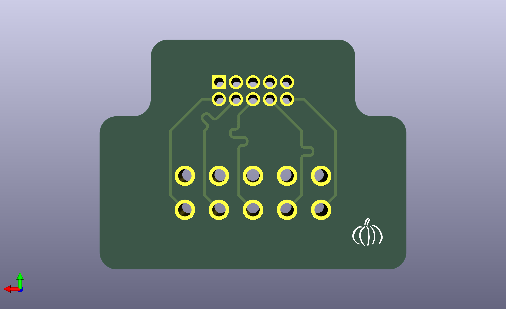
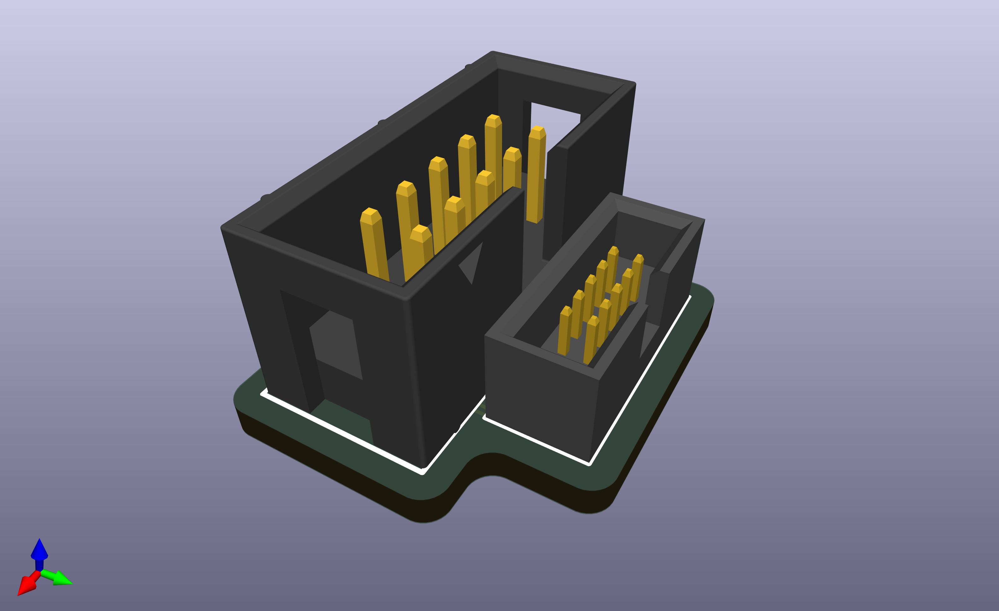

# IDC 2\*5P 1.27mm - 2\*5P 2.54mm adapter

Just a simple adapter board that converts IDC 2\*5P 1.27mm to 2\*5P 2.54mm 

## BOM

| Part Name              | LCSC Part | Quantity |
|------------------------|-----------|----------|
| HX_JN1_27-2X5P_ZZ_H4_9 | C42372547 | 1        |
| HDR-IDC-2_54-2X5P      | C5665     | 1        |

